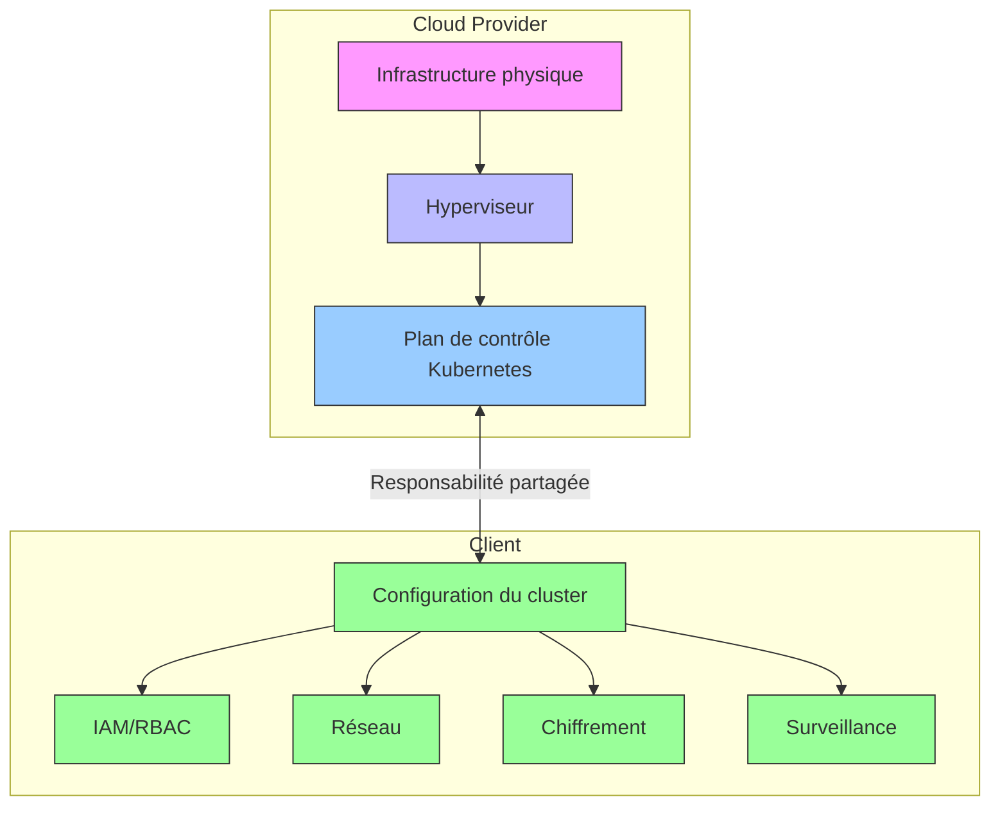
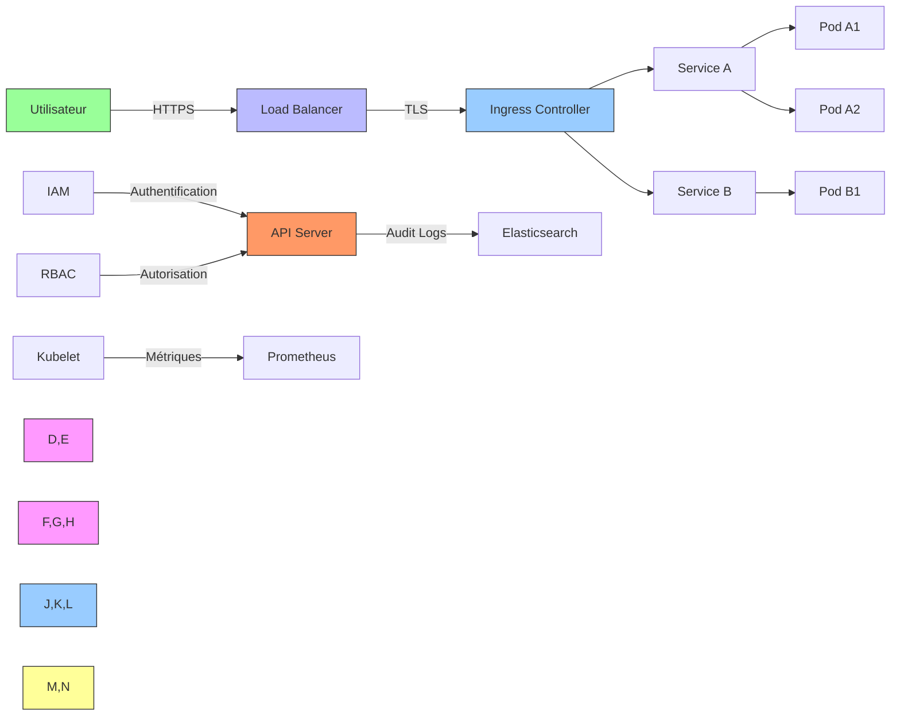
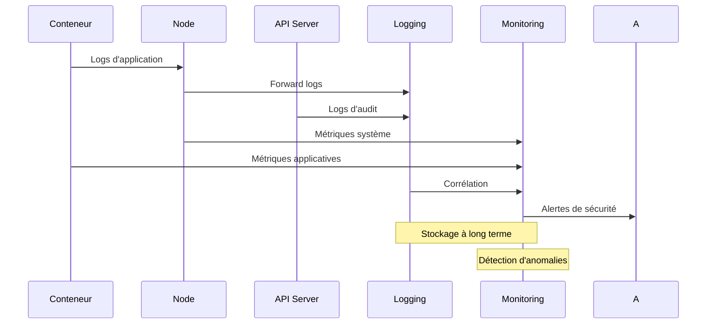

# Architecture de conformité SOC 2 pour Kubernetes

## Modèle de responsabilité partagée



## Flux de conformité SOC 2

```mermaid
flowchart TD
    A[Politiques de sécurité] --> B[Infrastructure as Code]
    B --> C[Pipeline CI/CD]
    C --> D[Surveillance continue]
    D --> E[Alertes et rapports]
    E --> F[Amélioration continue]
    F --> A
    
    subgraph SOC 2
        direction TB
        G[Sécurité] <--> H[Disponibilité]
        H <--> I[Confidentialité]
        I <--> J[Intégrité]
        J <--> K[Vie privée]
    end
    
    D --> SOC 2
```

## Architecture de référence EKS/GKE



## Flux de données de sécurité



Ces diagrammes peuvent être intégrés directement dans votre documentation Markdown. Ils seront automatiquement rendus dans GitHub et d'autres outils supportant Mermaid.

Pour les utiliser, copiez simplement le bloc de code mermaid dans vos fichiers Markdown.

[Retour à la documentation principale](../README.md)
