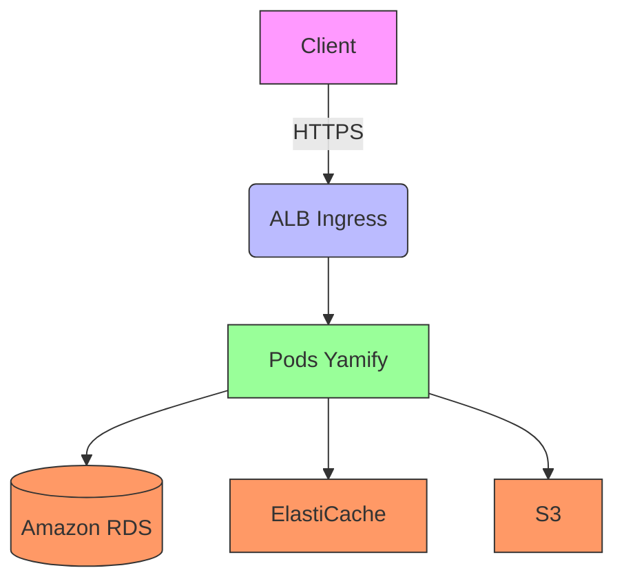
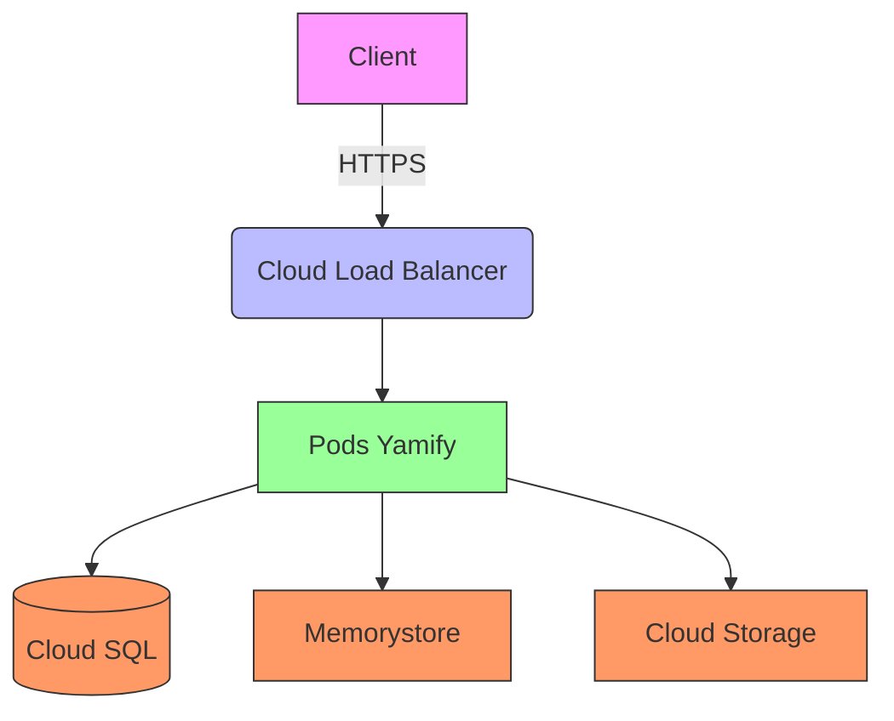

# Conformité SOC 2 pour Yamify

## Vue d'ensemble

Yamify s'engage à maintenir les plus hauts standards de sécurité et de conformité. Ce document décrit notre approche pour répondre aux exigences SOC 2 dans les environnements Kubernetes.

## Architecture de référence

### AWS EKS

### Google GKE

## Contrôles de sécurité clés

### 1. Authentification et autorisation
- **EKS** : Intégration IAM avec RBAC Kubernetes
- **GKE** : Workload Identity avec IAM
- **Yamify** : Authentification OIDC avec fournisseur d'identité

### 2. Chiffrement
- Données en transit : TLS 1.3
- Données au repos : Chiffrement avec KMS/Cloud KMS
- Secrets : Gérés via AWS Secrets Manager/Secret Manager

### 3. Journalisation et surveillance
- Centralisation des logs avec CloudWatch/Cloud Logging
- Surveillance avec Prometheus et Grafana
- Alertes sur les activités suspectes

## Références

- [AWS EKS Best Practices](https://docs.aws.amazon.com/eks/latest/userguide/best-practices.html)
- [GKE Security Overview](https://cloud.google.com/kubernetes-engine/docs/concepts/security-overview)
- [SOC 2 Trust Services Criteria](https://www.aicpa.org/interestareas/frc/assuranceadvisoryservices/aicpasoc2report.html)
