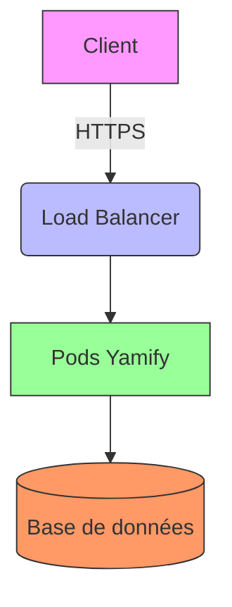

  

    <h1>Documentation SOC 2 pour Kubernetes</h1>
    
Guide complet pour la conformité SOC 2 des environnements Kubernetes sur AWS EKS et Google GKE

    

      <a href="#getting-started" class="btn btn-primary btn-lg">Commencer</a>
      <a href="https://github.com/yamify-org/soc-compliance" class="btn btn-outline-secondary btn-lg" target="_blank">
        <i class="fab fa-github me-2"></i>Voir sur GitHub
      </a>
    

  

  <section id="getting-started" class="mb-5">
    <h2 class="mb-4">Pour commencer</h2>
    

      

        

          

            <h3 class="h5 card-title">Introduction</h3>
            
Découvrez les bases de la conformité SOC 2 et comment elle s'applique à Kubernetes.

            <a href="/docs/introduction/overview" class="btn btn-sm btn-outline-primary">En savoir plus</a>
          

        

      

      

        

          

            <h3 class="h5 card-title">Rapports SOC</h3>
            
Comprendre les différents types de rapports SOC et leurs exigences.

            <a href="/docs/introduction/soc-reports" class="btn btn-sm btn-outline-primary">En savoir plus</a>
          

        

      

      

        

          

            <h3 class="h5 card-title">Responsabilité partagée</h3>
            
Modèle de responsabilité partagée dans le cloud pour la conformité SOC 2.

            <a href="/docs/introduction/shared-responsibility" class="btn btn-sm btn-outline-primary">En savoir plus</a>
          

        

      

    

  </section>

  <section class="mb-5">
    <h2 class="mb-4">Guides par plateforme</h2>
    

      

        

          

            

              
              <h3 class="h4 mb-0">AWS EKS</h3>
            

            <ul class="list-unstyled">
              <li class="mb-2">
                <i class="fas fa-check-circle text-success me-2"></i>
                <a href="/docs/aws-eks/security-best-practices">Bonnes pratiques de sécurité</a>
              </li>
              <li class="mb-2">
                <i class="fas fa-cog text-primary me-2"></i>
                <a href="/docs/aws-eks/configuration">Configuration recommandée</a>
              </li>
            </ul>
          

        

      

      

        

          

            

              
              <h3 class="h4 mb-0">Google GKE</h3>
            

            <ul class="list-unstyled">
              <li class="mb-2">
                <i class="fas fa-check-circle text-success me-2"></i>
                <a href="/docs/gcp-gke/security-best-practices">Bonnes pratiques de sécurité</a>
              </li>
              <li class="mb-2">
                <i class="fas fa-cog text-primary me-2"></i>
                <a href="/docs/gcp-gke/configuration">Configuration recommandée</a>
              </li>
            </ul>
          

        

      

    

  </section>

  <section class="mb-5">
    <h2 class="mb-4">DevSecOps</h2>
    

      

        

          

            <h3 class="h5 card-title">Vue d'ensemble</h3>
            
Intégrez la sécurité dans votre pipeline CI/CD pour une conformité continue.

            <a href="/docs/devsecops/overview" class="btn btn-sm btn-outline-primary">En savoir plus</a>
          

        

      

      

        

          

            <h3 class="h5 card-title">Surveillance</h3>
            
Mettez en place une surveillance efficace pour détecter les problèmes de sécurité.

            <a href="/docs/devsecops/monitoring" class="btn btn-sm btn-outline-primary">En savoir plus</a>
          

        

      

      

        

          

            <h3 class="h5 card-title">Automatisation</h3>
            
Automatisez les contrôles de conformité pour gagner du temps et réduire les erreurs.

            <a href="/docs/devsecops/automation" class="btn btn-sm btn-outline-primary">En savoir plus</a>
          

        

      

    

  </section>

## Mermaid Example

          

            <i class="fas fa-project-diagram fa-2x mb-3 text-primary"></i>
            <h3 class="h5 card-title">Architecture</h3>
            
Diagrammes d'architecture de référence

            
          

        

      

      

        

          

            <i class="fas fa-book fa-2x mb-3 text-primary"></i>
            <h3 class="h5 card-title">Bibliographie</h3>
            
Références et ressources complémentaires

            
          

        

      

      

        

          

            <i class="fas fa-book-reader fa-2x mb-3 text-primary"></i>
            <h3 class="h5 card-title">Glossaire</h3>
            
Définitions des termes techniques

            
          

        

      

      

        

          

            <i class="fas fa-question-circle fa-2x mb-3 text-primary"></i>
            <h3 class="h5 card-title">FAQ</h3>
            
Questions fréquemment posées

            
          

        

      

    

  </section>

  

    

      

        

          <h3 class="h5 card-title">Besoin d'aide ?</h3>
          
Consultez notre FAQ ou ouvrez une issue sur GitHub pour obtenir de l'aide.

          

            <a href="/docs/references/faq" class="btn btn-outline-primary btn-sm">Voir la FAQ</a>
            <a href="https://github.com/yamify-org/soc-compliance/issues/new" class="btn btn-outline-secondary btn-sm" target="_blank">
              <i class="fab fa-github me-1"></i>Ouvrir une issue
            </a>
          

        

      

    

    

      

        

          <h3 class="h5 card-title">Contribuer</h3>
          
Les contributions sont les bienvenues ! Aidez-nous à améliorer cette documentation.

          <a href="/CONTRIBUTING" class="btn btn-primary btn-sm">
            <i class="fas fa-code-branch me-1"></i>Comment contribuer
          </a>
        

      

    

  

